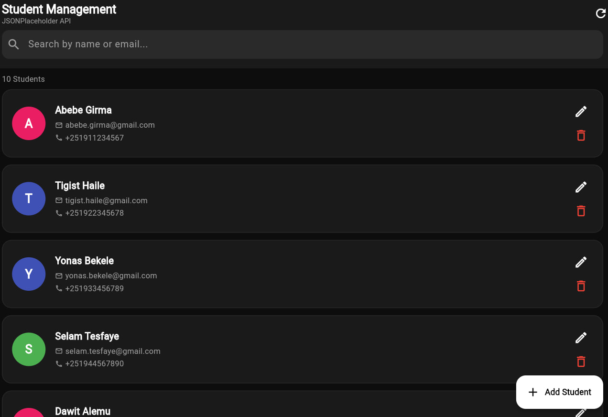
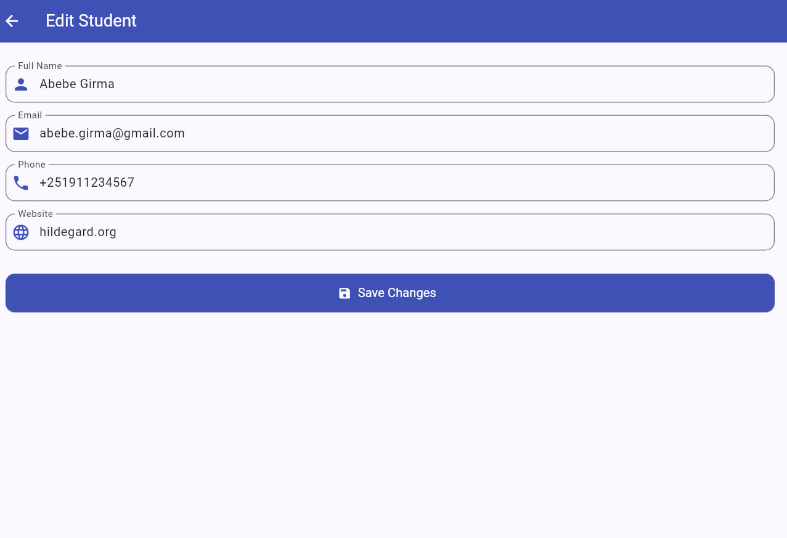

# Student Management App

A Flutter application that performs CRUD operations using JSONPlaceholder API.

## Tech Stack
- **State Management:** Bloc / Provider
- **Network:** Dio / http
- **API:** JSONPlaceholder

## Features
- View list of students
- Add new student
- Edit existing student
- Delete student
- Error handling and loading states

## Screenshots

### Home Screen

### Add Student

### Edit Student

### Delete Student

### Delete Confirmation

